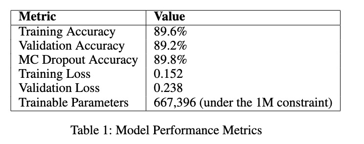

# Fine-tuning-with-LoRA

## Overview

This repository implements an efficient text classification system for the AG News dataset using a RoBERTa-base model enhanced with Low-Rank Adaptation (LoRA). The solution is designed to maximize test accuracy while strictly limiting the number of trainable parameters to **≤1 million**, in accordance with the project requirements.

---

## Features

- **LoRA-Enhanced RoBERTa:** Only LoRA adapters are trainable; all base model weights are frozen for efficiency and compliance.
- **Parameter Efficiency:** All modifications ensure ≤1 million trainable parameters.
- **Data Augmentation:** Optional synonym-based augmentation using `nlpaug` and WordNet.
- **Validation & Early Stopping:** Automatic early stopping based on validation accuracy.
- **MC Dropout:** Supports Monte Carlo Dropout for robust uncertainty estimation.
- **Reproducibility:** All code, configurations, and random seeds are provided for full reproducibility.

---

## Project Structure

- **train-1.py**  #Training script with LoRA, augmentation, validation
- **inference-1.py**  #Inference script for test data prediction

  ## Installation

  1. **Clone the repository:**

    ```bash
   git clone https://github.com/geethaguruju/AG-News-LoRA.git
   cd AG-News-LoRA
    ```

  ## Usage

### 1. Training

Train the LoRA-adapted RoBERTa model on AG News:

- **python train-1.py**

**Key Training Features:**
- Loads AG News via HuggingFace Datasets.
- Optionally applies synonym-based augmentation (default: enabled).
- Uses LoRA adapters (configurable rank, alpha, dropout).
- Early stopping based on validation accuracy.
- Saves best model and tokenizer to `best_lora_finetuned_roberta_final`.

**Main Hyperparameters:**
| Parameter      | Value (default) |
| -------------- | --------------- |
| MAX_LEN        | 256             |
| BATCH_SIZE     | 256             |
| EPOCHS         | 3               |
| LEARNING_RATE  | 1e-5            |
| LORA_R         | 2               |
| LORA_ALPHA     | 4               |
| LORA_DROPOUT   | 0.05            |
| AUGMENTATION   | True            |

---

### 2. Inference

Run predictions on unlabeled test data:

- **python inference-1.py**


- Loads the best saved model and tokenizer from `best_lora_finetuned_roberta_final/`.
- Reads test data from `test_unlabelled.pkl` (expects a dict with key `'text'`).
- Outputs predictions to `predictions.csv`.

---

## LoRA Details

- **Adapters:** LoRA adapters are applied to the attention `query` and `value` matrices.
- **Configurable:** Rank (`r`), alpha, and dropout are tunable.
- **Parameter Limit:** All configurations ensure total trainable parameters ≤1 million.

---

## Accuracy Table




## Dataset

- **AG News:** Four-class news topic classification.
- **Source:** Loaded via HuggingFace Datasets (`ag_news`).
- **Augmentation:** Synonym replacement using WordNet (via `nlpaug`).

---

## Reproducibility

- All random seeds are set for reproducibility.
- Model and tokenizer checkpoints are saved for inference and further evaluation.
- Training and validation logs are provided for transparency.

---

## References

- LoRA: Low-Rank Adaptation of Large Language Models (Hu et al. 2021)
- AG News Dataset (Zhang et al. 2015)
- HuggingFace Transformers

---
## Contributing

Contributions to enhance the model, improve data preprocessing, or refine training techniques are welcome. Please open an issue or submit a pull request.

## License

This project is licensed under the MIT License. See the [LICENSE](LICENSE) file for details.

## Team

- **Venkat Kumar Laxmi Kanth Nemala** (vn2263@nyu.edu)
- **Sheetal Prasad** (sp7990@nyu.edu)
- **Geetha Krishna Guruju** (gg3039@nyu.edu)

---

## Quick Start Table

| Script          | Purpose                  | Input                  | Output                 |
|-----------------|-------------------------|------------------------|------------------------|
| `train-1.py`    | Train model with LoRA    | AG News dataset        | Model checkpoint       |
| `inference-1.py`| Predict on test data     | `test_unlabelled.pkl`  | `predictions.csv`      |

---

**Note:** For detailed methodology, ablation studies, and results, please refer to the project report (`miniproject2_spring25-1.pdf`).

---

